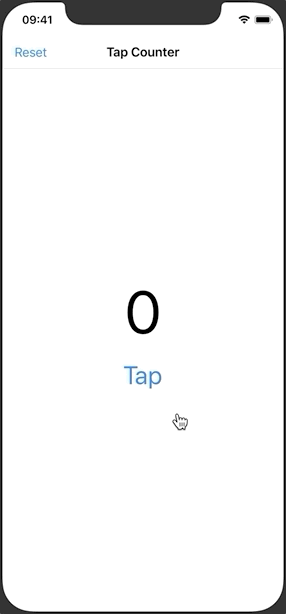

## 100 Days of Swift 5

**十来个 SwiftUI 小项目，帮助入门者快速学习如何搭建声明式应用。**

项目灵感来源于 [samvlu's 100-days-of-swift](http://samvlu.com/index.html)，并用 SwiftUI 重写。 部分资源来自 [Edison Hsu](https://github.com/Edison-Hsu/100-days-of-RxSwift)。

开发环境：

- Swift 5
- Xcode 11.5
- Simulator iPhone 11 Pro

注意，项目并不包含对 Swift 基础知识的讲解。如果你完全搞不清楚它们是如何实现的，请先学习以下内容：

- [Swift 编程语言中文版](https://www.cnswift.org/)
- [斯坦福 CS193P Swift 公开课](https://cs193p.sites.stanford.edu/)

**祝编程愉快！**

### Project 1 - Tap Counter

### Project 2 - Hold Counter

### Project 3 - Tip Calculator

### Project 4 - Text Formatter

### Project 5 - Basic Image View

### Project 6 - Cover Flow

### Project 7 - View And Controls

### Project 8 - Basic List

### Project 9 - Passing Data Between Views

### Project 10 - Hide Keyboard

### Project 11 - Add Photo from Camera Roll

### Project 12 - Add New Item

