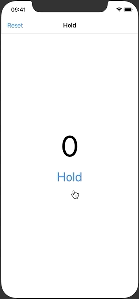
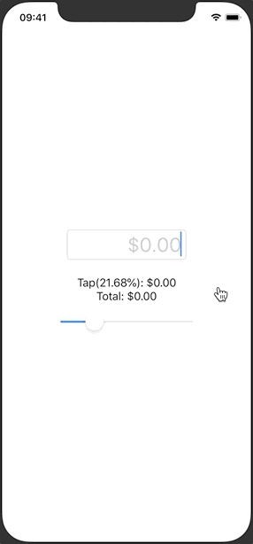
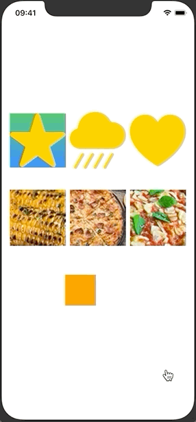
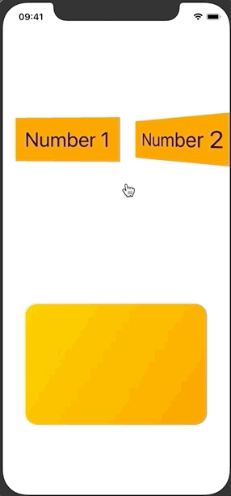
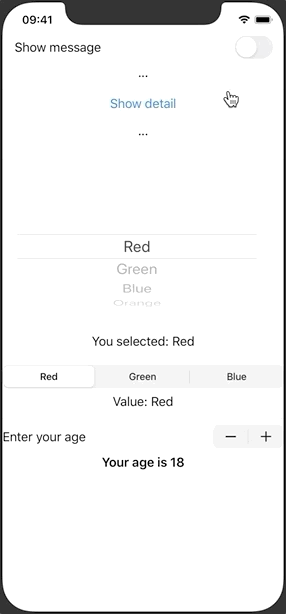
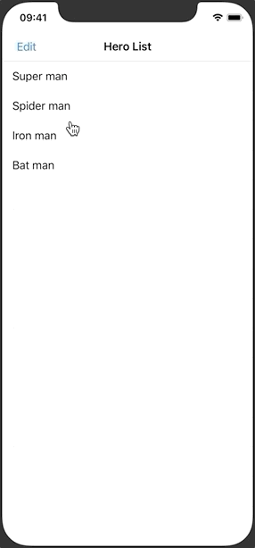
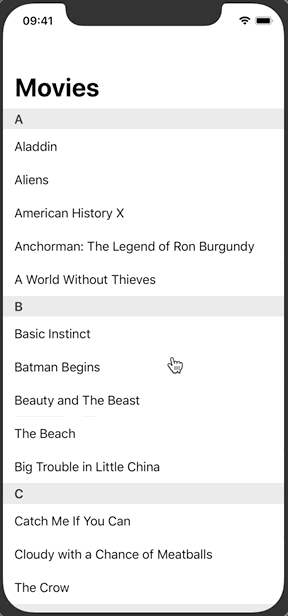

## 100 Days of Swift 5

**Some tiny projects to help you quickly learn how to build a simple iPhone app.**

👉🏼 [中文传送门 / Chinese Version](README-CN.md) 👈🏼

Similar with [samvlu's 100-days-of-swift](http://samvlu.com/index.html),  but write by SwiftUI. Some resource comes from [Edison Hsu](https://github.com/Edison-Hsu/100-days-of-RxSwift).

Code environment:

- Swift 5
- Xcode 11.5
- Simulator iPhone 11 Pro

These projects does not include an explanation of the basics of SwiftUI. If you do not understand how the code works, please learn the following tutorial first:

- [The Swift Programming Language](https://swift.org/)
- [Stanford CS193P Developing Applications for iOS](https://cs193p.sites.stanford.edu/)

**Happy programming!**

### Project 1 - Tap Counter

### Project 2 - Hold Counter

### Project 3 - Tip Calculator

### Project 4 - Text Formatter

### Project 5 - Basic Image View

### Project 6 - Cover Flow

### Project 7 - View And Controls

### Project 8 - Basic List

### Project 9 - Passing Data Between Views

### Project 10 - Hide Keyboard

### Project 11 - Add Photo from Camera Roll

### Project 12 - Add New Item

### Project 13 - Basic List

### Project 14 - Dynamkc Data for Each Cell

### Project 15 - Picker

### Project 16 - CoreDate

